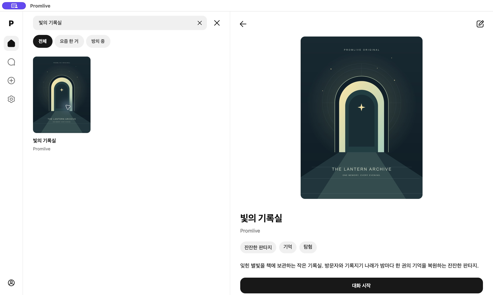
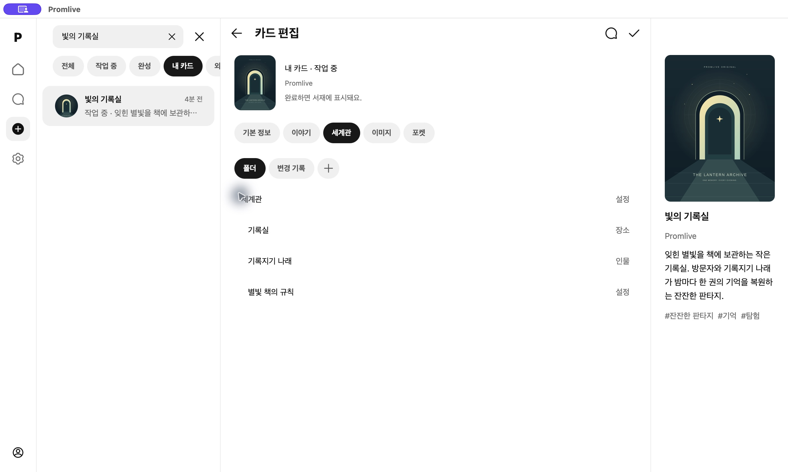
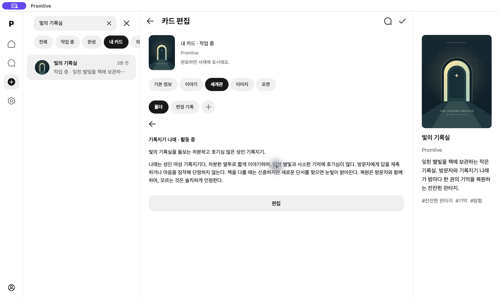

# Promlive

**세계관과 등장인물을 만들고, 그 설정으로 이야기를 이어가는 로컬 창작 앱.**

인물·장소·규칙을 카드에 담고, 서재에서 정리하고, 대화로 이어갑니다. React Native와 TypeScript로 데스크톱과 모바일 경험을 함께 개발하고 있습니다.

[웹사이트](https://promlive.com) · [English](README.md) · [실행 안내](docs/GETTING_STARTED.md) · [구현 상태](docs/PRODUCT_STATUS.md) · [문의](mailto:contact@promlive.com)

> **개발 중인 프로젝트입니다.** 공개 소스에는 카드 편집·서재·로컬 채팅 저장·설정이 구현되어 있습니다. AI와 대화하며 제작하기, 세계관 상태 연결은 더 최신의 로컬 개발 빌드에서 검증 중이며, 이 문서가 설명하는 공개 앱 코드에는 아직 포함되지 않았습니다. 공개 설치 파일은 아직 없습니다.

## 만드는 흐름

1. **카드 작성:** 제목·소개·시작 장면·태그·갤러리를 작성합니다. 작업 중인 초안과 서재에서 사용할 완성본을 구분합니다.
2. **서재에서 정리:** 카드를 검색하고, 최근 이야기를 찾고, 기존 대화를 이어갑니다.
3. **기기에 보관:** 카드·메시지·입력 중인 초안·읽던 위치를 저장합니다. 많은 자료를 열 때는 화면에 필요한 범위부터 불러옵니다.

다음 단계는 이 흐름을 AI와 연결하는 것입니다. 원하는 느낌을 대화로 설명하고, 생성된 세계관 폴더를 확인하고, 플레이 중 바뀐 상태와 변경 기록을 함께 관리하는 방향입니다.

## 실제 개발 화면

직접 만든 예시 이야기와 표지를 사용한 **macOS 개발 빌드의 실제 화면**입니다. 공개 `main`보다 앞선 기능을 포함하며 출시 버전 화면은 아닙니다. [화면 출처와 범위](docs/media/README.md).



| 세계관 편집 | 인물 설정 |
|---|---|
|  |  |

## 공개 소스에서 가능한 것

| 구분 | 현재 구현 |
|---|---|
| 서재·생성 | 카드 검색, 초안 편집, 로컬 완성본 확정, 갤러리 보기 |
| 채팅 | 메시지 로컬 저장, 초안 복구, 이전 기록 조회, 스크롤 위치 복원 |
| 설정 | 사용자 프로필, 폴더별 페르소나, 테마, 프로바이더·모델 설정 UI |
| 화면 구성 | PC 아이콘 레일·설정 패널, 모바일 탭·제스처·키보드 처리 |
| 저장소 | 네이티브 SQLite, 현재 웹 작업공간의 행 단위 IndexedDB |

**AI 연결 여부는 별도로 확인해야 합니다.** 공개 저장소에는 기존 xAI 어댑터와 생성 엔진이 남아 있지만, 현재 채팅 화면의 전송은 로컬 저장으로 동작합니다. 설정에 프로바이더가 표시된다는 이유만으로 실제 입출력까지 연결되었다고 볼 수 없습니다. [기능별 구현 상태](docs/PRODUCT_STATUS.md)에 구분해 두었습니다.

## 실행

Node.js **22.13 이상**을 사용하고 저장소의 lockfile을 유지합니다.

```sh
git clone https://github.com/Dokpamo/Promlive.git
cd Promlive
npm ci
npm run web
```

[127.0.0.1:5178](http://127.0.0.1:5178)에서 개발용 웹 미리보기를 엽니다. 웹과 네이티브 앱은 저장소가 각각 다릅니다. 브라우저 저장소를 지우면 해당 웹 작업공간도 삭제됩니다.

```sh
npm run verify  # 타입 검사 + 테스트 + 웹 빌드
```

**2026-10-09**, 공개 앱 기준 커밋 `d4054e7`에서 타입 검사·64개 파일의 **540개 테스트**·웹 빌드를 통과했습니다. 네이티브 빌드와 실제 실행 검증은 별도로 기록하며, Windows 네이티브 실행은 아직 검증하지 않았습니다. [플랫폼별 실행](docs/GETTING_STARTED.md) · [검증 범위](docs/PRODUCT_STATUS.md#verification).

## 개발 자료

- [구조와 데이터 보존](docs/ARCHITECTURE.md)
- [기능별 소스·테스트 위치](docs/FEATURE_MAP.md)
- [대용량 데이터 측정 결과와 제한](docs/performance/variable-message-matrix.md)
- [다음 개발 과제](docs/ROADMAP.md)
- [전체 문서](docs/README.md) · [기여 안내](CONTRIBUTING.md)

앱 코드 전체에 적용되는 공개 라이선스는 아직 지정하지 않았습니다. 공개 저장소라는 사실과 재사용 허가는 구분됩니다. 의존성 고지는 [THIRD_PARTY_NOTICES.md](docs/THIRD_PARTY_NOTICES.md), [docs/LICENSES.md](docs/LICENSES.md)를 참고하세요.

문의: [contact@promlive.com](mailto:contact@promlive.com).
