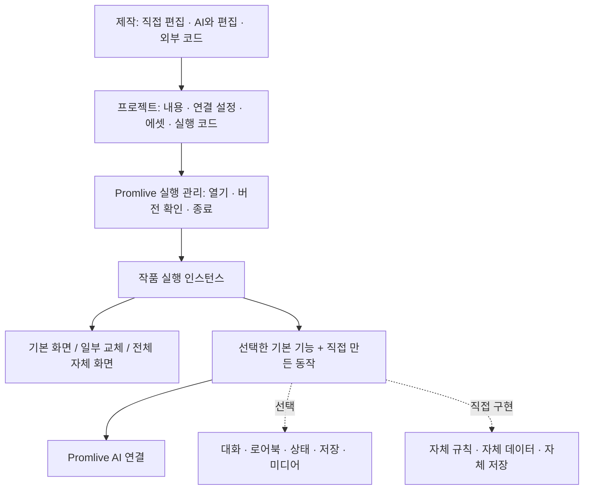

# Promlive 카드·미니앱 구조 제안

2026-09-26 작성. 구현된 기능의 설명이 아니라 다음 작업을 위한 설계안이다.

Promlive 안에서 작품을 실행한다. 제작자는 기본 채팅·저장·로어북·상태창·에셋 기능을 필요한 만큼 쓰고, 일부 또는 전부를 자신의 코드로 바꿀 수 있다. AI 연결만 사용하고 화면·진행 규칙·저장을 직접 만드는 작품도 같은 목록에서 실행한다.

**카드는 작품을 여는 목록 항목이고, 그 안에는 실행할 프로젝트가 있다.** 채팅 카드와 미니앱은 별도 제품 형식으로 나누지 않는다. 새 프로젝트를 만들 때 선택하는 예시는 초기 구성일 뿐이며, 나중에 다른 구성을 섞을 수 있다.

## 1. 세 가지 책임



| 책임 | 소유하는 것 | 작품에 강제하지 않는 것 |
|---|---|---|
| Promlive 호스트 | 설치된 프로젝트 정보, 실행·종료, 사용자가 연결한 AI, 실행 형식 선택 | 채팅방 생성, 대화 기록 저장, 로어북, 특정 UI |
| 기본 기능 모듈 | 채팅, 로어북 조회, 상태 관리, 저장, 상태창, 이미지·BGM 등 선택한 기능 | 다른 기본 모듈 전체의 사용 |
| 작품 | 화면 구성, 기능 선택, 진행 규칙, AI에 보낼 내용, 자체 코드 | 기본 편집기의 데이터 형식을 자체 코드 전체에 적용하는 것 |

작품이 전체 화면을 제공하면 기본 채팅의 제목·입력창·제스처는 그 위에 함께 실행하지 않는다. Promlive로 돌아오는 통로와 실행 종료 책임은 호스트에 남긴다. 기존 UI의 눌림·곡률·키보드 동작은 기본 화면을 선택했을 때 재사용한다.

## 2. 화면 교체와 동작 교체를 분리한다

한 번에 모든 확장 지점을 공개하지 않고, 첫 구현에서는 **전체 화면**과 **기본 채팅 안의 상태창 영역** 두 곳으로 교체를 검증한다.

- 전체 화면 교체: 게임·비주얼노벨·도구 등 작품의 화면을 실행한다. 기본 채팅 모듈 없이 AI만 호출할 수 있다.
- 상태창 교체: 기본 채팅과 저장을 사용하면서 상태 표시만 직접 만든 구성 요소로 바꾼다.
- 이후 실제 요구에 맞춰 메시지 표시·입력창 등으로 같은 연결 방식을 넓힌다. 단순 색상·글자·간격 변경은 코드 교체 없이 기본 화면의 설정으로 처리한다.

화면은 데이터와 동작을 전달받는다. 예를 들어 상태창에는 `hp`, `location` 등의 현재 값과 `useItem` 같은 허용된 동작을 전달한다. 화면을 바꿔도 상태의 주인은 바뀌지 않는다.

엔딩 후 입력 금지는 상태창이 입력 버튼만 숨겨 구현하지 않는다. 기본 채팅을 쓰는 작품이라면 전송을 접수하는 경로에서도 현재 진행 상태를 확인한다. 자체 화면·자체 규칙을 쓰는 작품은 해당 구현이 이 책임을 가진다.

가로 비주얼노벨은 화면 구성과 방향 설정을 선택할 수 있게 한다. 실제 기기 방향 전환은 실행기가 처리하고, 작품 종료 시 기존 방향 설정을 복원한다. 지원 여부는 실행 환경에 따라 확인한다.

## 3. 기본 편집기는 관련 내용을 한 묶음으로 보여준다

제작 화면에서는 사용자가 원하는 로어북 중심의 정리를 제공한다. 인물·장소·세계관별 묶음 안에서 관련 내용을 같이 편집한다.

```text
달빛 도시
  설명·프롬프트       AI가 알아야 하는 도시 설정
  적용 조건           이 설정을 언제 AI에게 전달할지
  연결 에셋           낮/밤 배경, 도시 BGM
  상태 연결           현재 장소, 시간대
  동작                도시에 입장했을 때 배경 변경
  화면 연결           장소 이름·이미지를 표시할 상태창
```

편집에서는 한 묶음으로 다루되 실행 책임은 구분한다.

- 도시 이름이 대화에 언급되면 도시 설명만 AI 문맥에 넣을 수 있다.
- 실제 도시 입장 동작이 발생하면 위치 상태와 배경·BGM을 바꾼다.
- 상태창은 바뀐 위치 상태를 읽어 표시한다.

이렇게 해야 도시를 언급했다는 이유만으로 화면과 음악이 매번 바뀌지 않는다. 관련 설정을 한곳에 모으는 편의와 실행 규칙의 정확성을 함께 유지한다.

에셋은 프로젝트 안의 공용 저장소에 보관하고 각 묶음이 ID로 참조한다. 같은 이미지를 여러 인물·장소가 사용해도 파일은 복제하지 않는다. 물리적 파일과 논리적 소유·참조를 구분하고, 참조 중인 에셋을 묶음 삭제와 함께 무조건 지우지 않는다.

AI만 사용하는 자체 앱에는 이 로어북 구성을 요구하지 않는다.

## 4. 프로젝트 정의와 실제 진행 데이터를 분리한다

| 데이터 | 예 | 소유·저장 규칙 |
|---|---|---|
| 제작 정의 | 프롬프트, 상태 초기값, 규칙, 화면 코드 | 프로젝트 버전의 내용 |
| 실행 상태 | 현재 체력, 위치, 엔딩 도달 여부 | 실행 세션별 값. 선택한 상태 기능 또는 작품 코드가 소유 |
| 대화 기록 | 사용자 메시지, AI 응답 | 기본 채팅을 쓸 때만 필요한 데이터 |
| 편집 초안 | 아직 적용하지 않은 AI 수정, 직접 편집 중인 값 | 실행 중인 버전과 별도 보관 |

초기 체력을 100으로 정의한 것과 플레이 중 체력이 70이 된 것은 다른 데이터다. 상태창·로어북 조건·진행 규칙이 같은 실행 상태를 읽게 하며, 각자 별도 체력 값을 저장하지 않는다.

AI 결과로 상태를 변경하는 기본 기능을 넣을 때는 구조화된 변경 제안을 검증한 뒤 상태 관리자가 적용한다. 텍스트 응답만 받을 수 있는 모델에서는 해석 실패를 처리하고, 실패한 응답이 상태를 절반만 바꾸지 않게 한다. 상태창이 답변 문자열을 따로 분석해 원본 상태를 덮어쓰지 않는다.

프로젝트 업데이트는 새 버전으로 설치하고 진행 중인 실행은 시작한 버전을 유지한다. 저장 데이터 형식이 달라지면 변환이 필요하다. 코드 버전 복원과 저장 데이터 복원은 별도로 다룬다. 자체 저장을 선택한 작품은 변환·복원도 자체 책임이며, 호스트가 모든 저장 방식을 자동 복구한다고 약속하지 않는다.

## 5. AI 연결은 채팅과 독립된 작은 계약으로 만든다

기본 채팅, 제작 도우미, 외부 미니앱이 같은 AI 요청 경로를 사용한다.

```text
작품의 요청
  → 실행 인스턴스 확인
  → 사용자가 연결한 모델·설정 결정
  → 생성 / 스트리밍 / 취소
  → 요청한 작품에 결과 반환
```

첫 계약은 생성 시작, 응답 스트림, 취소, 실제 사용 가능한 모델 기능 조회로 제한한다. 요청마다 실행 ID와 요청 ID를 가진다. API 키와 프로바이더 통신은 호스트가 소유하며 작품에는 AI 호출 인터페이스만 전달한다.

중요한 조건은 다음과 같다.

- AI 호출에 카드 본문이나 `conversationId`를 필수로 넣지 않는다. 게임이 현재 보드 상태만 보내는 것도 가능하다.
- 기본 채팅은 선택한 로어북·대화 기록을 조합해서 요청하고, 자체 앱은 문맥을 직접 구성한다. 호스트가 숨은 대화 기록을 자동으로 추가하지 않는다.
- 호출 시작 때 모델 설정을 캡처하고, 진행 중 설정 변경이 기존 요청을 바꾸지 않게 한다.
- UI에 있는 제공자 이름과 실제 호출 가능한 기능은 구분한다. 현재 실제 생성 경로는 xAI이므로 다른 제공자는 어댑터를 구현한 뒤 사용 가능하다고 알린다.
- 취소·실패·정상 종료를 구분하고, 자동 재시도로 같은 유료 요청을 중복 실행하지 않는다. 종료된 인스턴스로 늦게 도착한 결과를 전달하지 않는다.
- 화면 표시와 실행 수명을 구분한다. 잠깐 설정을 여는 것만으로 대화 생성을 취소하지 않는다. 작품 실행을 실제 종료할 때 해당 실행의 요청·리스너를 정리한다.

지금의 `GenerationCoordinator`는 이미 채팅 기록 없이 요청을 처리할 수 있다. 이를 재사용하되 외부 계약이 `features/chat`이나 카드 스키마에 의존하지 않도록 정리한다. `CreationService`와 `ChatSession`은 기본 채팅·편집의 책임을 유지한다.

## 6. 실행 형식은 별도 실행기가 맡는다

프로젝트 형식에 WebView를 필수로 넣지 않는다. 실행할 화면·코드의 형식을 보고 맞는 실행기를 선택한다.

| 실행 형식 | 역할 | 첫 확인 범위 |
|---|---|---|
| 기본 구성 | 선택한 기본 RN 화면과 기능을 조립 | 현재 채팅을 유지하면서 상태창만 교체 |
| RN 번들 | 작품이 만든 RN 화면을 Promlive 안에 표시 | 별도로 빌드한 작은 화면의 로드·AI 호출·종료·재열기 |
| 웹 번들 | 웹으로 제작한 작품을 웹 실행 환경에서 표시 | 기존 `html-worker`는 호환용으로 유지하고 필요한 기능을 검증하여 확장 |

공식 RN 문서는 기존 앱에 RN 화면을 통합하는 방법을 설명한다. 이는 화면 통합의 근거이며, 임의의 외부 번들 로더·격리·스토어 허용을 이미 제공한다는 근거가 아니다. [RN 0.81 통합 문서](https://reactnative.dev/docs/0.81/integration-with-existing-apps)

RN 실행기는 현재 앱의 RN·React 버전과 제공 가능한 구성 요소에 맞는 번들을 대상으로 먼저 검증한다. 별도 프로젝트의 실행 코드와 에셋을 로드하고 기본 채팅 화면 대신 표시하는 실험이 먼저다. `import()` 한 줄이나 함수 몇 개만 전달해서 임의 외부 코드까지 격리됐다고 간주하지 않는다. 호스트 자격 증명·다른 작품 데이터에 접근하지 못하는 실제 실행 경계도 이 실험에서 확인해야 한다.

작성 언어는 프로젝트의 분류 기준이 아니다. **배포 결과물이 어떤 실행 환경을 요구하는지**를 명시한다. 현재 지원하지 않는 실행 형식은 설치 때 구체적으로 표시한다. 모든 언어의 원본 파일이 그대로 실행되거나 서로 다른 화면 기술이 설정만으로 섞인다고 약속하지 않는다. 다른 언어의 상태창도 지원 실행 형식으로 제공할 수 있다면 같은 데이터·동작 계약으로 연결한다.

배포·심사 확인은 실행기별로 다루고, 이 설계가 특정 배포 방식의 허용을 확정하는 것은 아니다.

## 7. 배포 파일은 최소 정보만 필수로 가진다

다음은 내보내기 파일 내부의 논리적 구성 예시이며, 확정된 공개 파일 규격은 아니다.

```text
작품 패키지
  manifest.json       식별자, 버전, 필요한 SDK·실행기, 진입점
  project.json        기본 기능 선택·연결 설정, 자체 앱이면 생략 가능
  content/            프롬프트·로어북 등, 선택 사항
  assets/             공용 에셋과 목록, 선택 사항
  bundles/            코드 실행 결과물, 코드가 필요한 경우
  editor/             편집 가능한 필드·원본 코드, 선택 사항
```

프로젝트 ID·버전·지원 실행 환경·진입점·요청 기능을 실행 전에 확인한다. 실행 파일은 검증을 통과한 버전 단위로 활성화하고 이전 정상 버전으로 돌아갈 수 있게 한다. 가져오기는 경로 이탈·중복 경로·압축 해제 용량을 확인하며 설치만으로 코드를 실행하지 않는다.

기본 채팅을 쓰는 작품은 기본 화면을 진입점으로 지정한다. 완전한 자체 앱은 자신의 화면을 진입점으로 지정하고 AI 연결만 요청한다. 기본 저장을 쓰지 않아도 작품의 설치 정보와 실행 버전은 호스트가 관리한다.

플레이 중 저장 데이터·사용자의 API 키는 작품 배포 파일에 넣지 않는다. 소스 공개는 필수가 아니다. 원본이나 편집 필드가 없는 외부 앱은 실행할 수 있어도 우리 폼 편집기로 내부 코드를 자동 편집할 수는 없다.

## 8. 직접 편집·AI 편집·외부 코드는 같은 프로젝트를 변경한다

기본 제작 화면은 작품 정보, 내용 묶음, 에셋, 화면, 동작, 테스트 진입점을 제공한다. 초보자는 프롬프트와 이미지, 기본 상태창을 연결하는 것만으로 시작한다. 코드나 복잡한 규칙은 필요한 경우에만 연다.

각 편집 대상에서 AI에게 해당 부분을 생성·수정하도록 요청할 수 있다. 예를 들어 한 인물의 말투만 수정할 때 그 인물의 정의, 연결된 상태 이름, 편집 규칙을 제공한다. 앱 전체 소스나 전체 에셋을 매번 보내지 않는다. 더 넓은 변경에 필요한 의존 관계는 명시적으로 추가 조회한다.

AI는 현재 편집 버전을 기준으로 변경안을 만들고, 사용자가 검토·적용·되돌릴 수 있게 한다. 응답을 기다리는 동안 사용자가 고친 내용을 오래된 AI 결과가 덮어쓰지 않게 한다. 기존 `CardEditor`의 revision·버퍼 보존 규칙을 이어 쓴다.

코드 구성 요소는 원하는 설정 항목을 편집기에 공개할 수 있다. 예를 들어 직접 만든 상태창이 `글자 크기`, `표시할 능력치`, `색상`을 공개하면 UI와 AI가 같은 필드를 수정한다. 공개하지 않은 내부 구현은 원본 코드 편집의 영역으로 남긴다.

미리보기는 별도 테스트 실행·저장 범위를 사용해서 실제 플레이 기록을 바꾸지 않는다. 기본 편집기가 관리하는 데이터와 코드 구성 요소의 설정을 함께 내보내고 다시 가져올 수 있게 한다.

## 9. 현재 코드에서 바꿀 경계

| 현재 | 제안 |
|---|---|
| `cards/model.ts`의 `template` 또는 `code` | v2 프로젝트 참조·구성. 기본 기능과 코드를 함께 선택 가능 |
| `app/runtime.ts`의 앱 전체 조립 | 기존 조립을 유지하고 프로젝트 실행 관리·AI 연결을 주입 |
| `features/chat/generation.ts` | 공용 AI 실행 책임으로 이동하고 기존 호출자를 연결 |
| `features/chat/ChatSession.ts` | 기본 채팅 모듈의 세션으로 유지. 초안·전송·취소 규칙 재사용 |
| `creator-sdk/protocol.ts` | v1 호환 어댑터를 남기고 작은 AI·실행 계약으로 이어 줌 |
| `creator-sdk/CodePreview*` | 웹 실행기의 한 구현으로 취급. 모든 작품의 필수 경로로 쓰지 않음 |
| `features/cards/CardEditor.ts` | 새 프로젝트 편집에서도 수정 버전·초안 보존 책임 유지 |
| `extensions/SummaryExtensions.ts` | 기존 한정 확장을 유지. 첫 작업에서 범용 플러그인 시스템으로 합치지 않음 |

새 책임은 `src/platform` 아래 프로젝트·실행·AI·실행기 단위로 추가할 수 있다. 기본 채팅은 현재 `features/chat`을 재사용한다. 폴더 전체 이동을 먼저 하지 않는다. 기능 지도에는 각 계약의 소유자·관련 검사만 추가한다.

기존 카드 ID와 대화 연결은 유지한다. v1 카드 읽기·기존 편집은 호환 경로를 두고, v2로 옮길 때 원본을 보존한다. DB 마이그레이션 실패가 기존 카드·대화를 초기화해서는 안 된다.

## 10. 구현 순서와 확인할 결과

1. **실행 경계부터 작은 실험으로 확인한다.** 별도 RN 프로젝트가 만든 화면을 앱 안에 로드해서 AI만 호출하고 종료·재열기한다. 현재 제공자 연결을 재사용한다. 여기서 번들 호환성·실행 종료·실제 격리 경계를 확인한 뒤 외부 RN 배포 형식을 확정한다.
2. **공용 AI 경로와 실행 관리를 연결한다.** 채팅 기록 없는 요청, 스트리밍, 취소, 늦은 응답 폐기, 설정 화면 왕복 시 기존 대화 생성 유지 등을 확인한다. 기존 초안·전송 검사를 유지한다.
3. **조합 가능한 프로젝트 형식을 넣는다.** 기존 카드를 읽으면서 기본 채팅+사용자 상태창, 자체 화면+AI만 연결 두 작품을 같은 실행 진입점으로 연다. 상태의 주인과 종료 책임을 검증한다.
4. **기본 편집기의 한 작품을 끝까지 연결한다.** 인물·장소 묶음, 프롬프트, 이미지, 최소 상태값, 상태창을 직접 편집하고 일부는 AI로 수정한다. 저장·다시 열기·내보내기·가져오기·이전 버전 실행까지 확인한다.
5. **그 과정에서 확인된 연결 지점만 확장한다.** 장면 변화, BGM, 입력 제한, 화면 방향, 메시지·입력창 교체 등을 실제 작품에 적용하면서 계약을 늘린다.

성공 기준은 서로 다른 두 작품이 같은 호스트에서 실행되는 것이다. 하나는 기본 채팅·저장을 쓰며 일부를 바꾸고, 다른 하나는 기본 채팅이나 저장 없이 자체 화면에서 AI만 사용한다. 둘 중 하나를 위해 모든 작품의 형식이나 앱 전체 상태를 고쳐야 한다면 책임 분리를 다시 조정한다.
