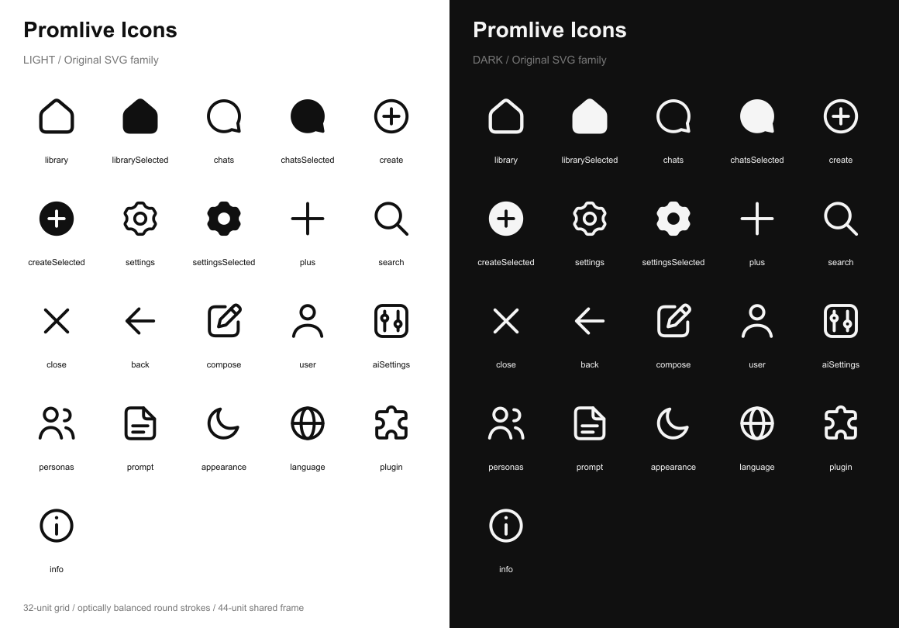

# Promlive 아이콘

2026-09-30. 제공된 JPEG의 둥근 선과 단순한 실루엣을 참고해 직접 작성한 SVG다. 하단 내비게이션에는 사용자가 선택한 **‘중심 보정’ 시안**의 경로를 그대로 적용한다. JPEG에서 원본 SVG를 추출한 것은 아니다.

## 확정한 하단 아이콘

| 탭 | 기본 | 선택 | SVG |
|---|---|---|---|
| 서재 | 문·창문 없는 집 | 같은 외곽 전체 채움 | [기본](../src/ui/icons/svg/library.svg) / [선택](../src/ui/icons/svg/librarySelected.svg) |
| 채팅 | 원형 몸통과 약간 넓힌 오른쪽 아래 꼬리 | 같은 외곽 전체 채움 | [기본](../src/ui/icons/svg/chats.svg) / [선택](../src/ui/icons/svg/chatsSelected.svg) |
| 생성 | 원 안의 플러스 | 채운 원과 투명 플러스 | [기본](../src/ui/icons/svg/create.svg) / [선택](../src/ui/icons/svg/createSelected.svg) |
| 설정 | 둥근 여섯 돌기의 톱니바퀴 | 채움과 넓힌 중심 구멍 | [기본](../src/ui/icons/svg/settings.svg) / [선택](../src/ui/icons/svg/settingsSelected.svg) |

- 좌표계는 32 × 32, 공통 배치 프레임은 기존 44 × 44다. 화면의 `navigationScale`만 적용한다. 412dp 화면에서 프레임은 약 29.33dp다.
- 선 두께는 집 2.65, 말풍선·원형 플러스 2.4, 톱니바퀴 2.3이다. 선 끝과 연결부는 `round`다.
- 실제 도형 크기(44px 프레임에서 측정): 집 38.0 × 38.3, 말풍선 37.2 × 37.1, 생성 37.6 × 37.6, 설정 36.4 × 37.4px. 기본과 선택의 외곽은 동일하다.
- 아이콘의 투명 여백을 보존한다. 그림을 잘라 별도 폭·높이로 늘리는 이전 보정은 사용하지 않는다.
- 제목·헤더·터치 영역·하단바 높이와 위치는 공통 규격을 따른다. 원형 플러스의 원은 아이콘 자체이며 별도의 회색 버튼 배경은 없다.
- 상단의 추가 버튼은 기존 단순 플러스, 설정 본문의 사용자 행은 기존 사람 아이콘을 유지한다. 하단 탭과 용도를 구분한다.

## 설정 중심의 광학 보정

기본 중심 원은 반지름 4.45, 선 두께 2.3이다. 빈 안쪽 지름은 6.60, 테두리를 포함한 외경은 11.20이다. 선택 상태에서는 빈 원만 중심으로 읽혀 작아 보일 수 있으므로, 선택 구멍의 반지름을 초기 시안 3.85에서 **4.85**로 넓혔다. 기본 원과 바깥 톱니는 바꾸지 않았다.

선택한 생성의 플러스와 설정의 구멍은 흰색 도형을 덧그린 것이 아니라 투명한 마스크다. 공통 팔레트의 라이트·다크 바탕에서 모두 배경이 비친다.

## 선택 전환

`src/ui/TabIcon.tsx`는 외곽·채움·내부 세부 이미지 레이어를 유지한다. 사용자 후속 요청에 따라 160ms 전환을 제거하고, 탭 선택과 같은 렌더에서 채움·내부 선·색을 즉시 바꾼다. 이미지를 교체하거나 효과가 끝나기를 기다리지 않는다.

- 선택 시 `foreground`와 채움, 해제 시 `secondaryForeground`와 윤곽선을 즉시 표시한다.
- 빠르게 다른 탭을 눌러도 이전 애니메이션이나 타이머가 남지 않는다.
- 네이티브·웹 모두 전환 애니메이션이 없고, 이미지 자체의 페이드도 끈다.
- 탭의 접근성 이름·선택 상태와 네 화면의 이동 기능은 유지한다.

## 소스와 생성

- 원본: `scripts/icon-artwork.cjs`. 하단 경로와 선택 전환용 레이어를 함께 관리한다.
- 생성: `node scripts/generate-navigation-icons.cjs`.
- SVG: `src/ui/icons/svg/*.svg`, 기본 17개와 선택 4개로 총 21개다.
- 앱: `src/ui/icons/sources.ts`에 264px 투명 PNG와 탭 레이어를 생성한다. 기존 React Native `Image`로 렌더링하며 추가 패키지는 없다.
- 검토 시트: `docs/icons/preview.svg`, `preview.png`. 앱 전체 테마 자동 전환 범위는 [UI_COLORS.md](UI_COLORS.md)를 따른다.

검색·닫기·뒤로가기·작성·사용자·AI·페르소나·프롬프트·테마·언어·플러그인·정보는 같은 원본 파일의 기존 경로를 사용한다. 확정한 하단 아이콘을 다른 역할의 버튼에 무조건 대체하지 않는다.

## 검증

- 하단 8개 SVG(4개 기본·선택)를 승인된 시안과 같은 440px 해상도로 렌더링했을 때 알파 픽셀 차이는 모두 0이었다. 전체 21개 아이콘에 캔버스 경계 잘림이 없다.
- Android 앱을 다시 불러와 네 탭을 실제로 눌러 기본·선택 상태를 확인했다. 선택한 생성의 플러스와 보정한 설정 구멍이 바탕색으로 표시된다. React Native/Android 런타임 오류 로그는 없었다.
- 헤더 `[0,63]–[1080,231]`, 제목 시작점 `[48,101]`, 하단바 `[0,2132]–[1080,2340]`, 네 탭의 각 270px 너비가 적용 전과 같다.
- TypeScript 검사, 새 UI 화면·이동·검색·편집 경계 테스트 7개, 웹 빌드를 통과했다. 웹 빌드의 기존 대용량 번들 경고는 남아 있다. 다른 네이티브 플랫폼의 실행과 전체 앱의 다크 모드 연결을 새로 검증한 것은 아니다.
